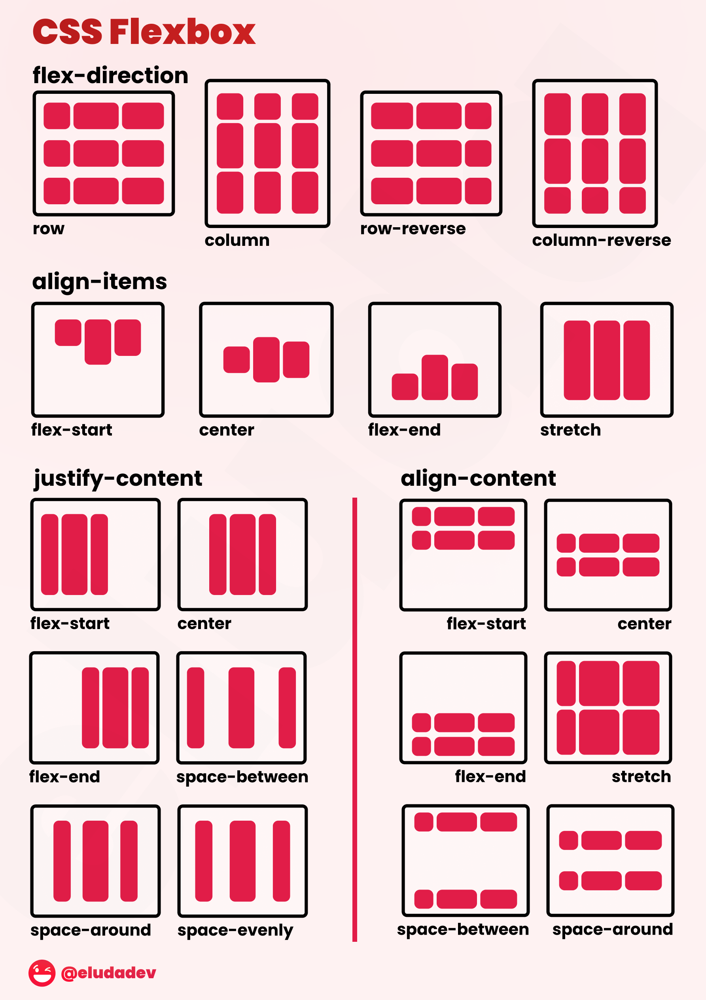

# Praktikum Pemrograman Web 2: CSS

## Table of Contents

- [Pengertian CSS](#pengertian-css)
- [Cara Menerapkan CSS](#cara-menerapkan-css)
  - [1. Inline CSS](#1-inline-css)
  - [2. Internal CSS](#2-internal-css)
  - [3. External CSS](#3-external-css)
- [Selektor CSS](#selektor-css)
  - [Selektor](#selektor)
  - [Selektor Atribut](#selektor-atribut)
  - [Pseudo-class dan Pseudo-element](#pseudo-class-dan-pseudo-element)
- [Properti CSS Penting](#properti-css-penting)
  - [Warna dan Latar Belakang](#warna-dan-latar-belakang)
  - [Font dan Teks](#font-dan-teks)
  - [Box Model](#box-model)
- [Display dan Position](#display-dan-position)
  - [Display](#display)
  - [Position](#position)
- [Flexbox](#flexbox)
- [Grid](#grid)
- [Responsif Design](#responsif-design)
  - [Media Queries](#media-queries)
  - [Ukuran Responsif](#ukuran-responsif)
- [CSS Variables (Custom Properties)](#css-variables-custom-properties)
- [Best Practice CSS atau Tips](#best-practice-css-atau-tips)
- [Contoh Proyek Praktikum](#contoh-proyek-praktikum)
  - [Membuat ...](#membuat-)

## Pengertian CSS

CSS (_Cascading Style Sheets_) adalah bahasa yang digunakan untuk mengatur tampilan dan format elemen HTML pada halaman web. CSS memungkinkan pemisahan antara konten (HTML) dan presentasi (gaya tampilan), sehingga kita dapat mengatur warna, font, layout, dan aspek visual lainnya dengan lebih terstruktur.

# Cara Menerapkan CSS

Ada tiga metode utama dalam menerapkan CSS ke dalam dokumen HTML:

## 1. Inline CSS

Inline CSS diterapkan langsung pada elemen HTML dengan menggunakan atribut `style`.

### Contoh:

```html
<p style="color: blue; font-size: 16px;">Teks ini berwarna biru</p>
```

### **Kelebihan**:

- Mudah dan cepat diterapkan pada elemen tertentu.
- Tidak memerlukan file terpisah.

### **Kekurangan**:

- Sulit dikelola untuk proyek besar.
- Tidak mendukung pemisahan antara konten dan gaya.
- Kurang efisien karena harus ditulis pada setiap elemen.

---

## 2. Internal CSS

Internal CSS ditulis di dalam elemen `<style>` dalam bagian `<head>` dari dokumen HTML.

### Contoh:

```html
<head>
  <style>
    p {
      color: red;
      font-size: 18px;
    }
  </style>
</head>
<body>
  <p>Teks ini berwarna merah</p>
</body>
```

### **Kelebihan**:

- Lebih mudah dikelola dibandingkan inline CSS.
- Tidak memerlukan file terpisah.
- Bisa digunakan untuk mengatur beberapa elemen sekaligus.

### **Kekurangan**:

- Tidak efisien untuk proyek besar.
- Dapat memperlambat waktu muat halaman jika banyak kode CSS di dalam HTML.

---

## 3. External CSS

External CSS ditulis dalam file terpisah dengan ekstensi `.css` dan dihubungkan ke dokumen HTML menggunakan elemen `<link>`.

### Contoh Implementasi:

<details>
  <summary>Klik untuk contoh css external</summary>

File HTML:

```html
<head>
  <link rel="stylesheet" href="style.css" />
</head>
<body>
  <p>Teks ini memiliki gaya dari file eksternal</p>
</body>
```

File `style.css`:

```css
p {
  color: green;
  font-size: 20px;
}
```

</details>

### **Kelebihan**:

- Memisahkan konten dari style sehingga lebih mudah dikelola.
- Dapat digunakan untuk banyak halaman sekaligus.
- Meningkatkan efisiensi dengan caching browser.

### **Kekurangan**:

- Membutuhkan proses load file CSS Terlebih lagi jika ada banyak file CSS eksternal yang diload, ini jelas akan membuat proses load halaman menjadi lama.
- Tidak akan diterapkan jika file CSS gagal dimuat.

---

## Kesimpulan

| Metode       | Kelebihan                                                       | Kekurangan                                              |
| ------------ | --------------------------------------------------------------- | ------------------------------------------------------- |
| **Inline**   | Mudah diterapkan, tidak butuh file terpisah                     | Sulit dikelola, tidak efisien, bercampur dengan HTML    |
| **Internal** | Bisa digunakan untuk beberapa elemen, tidak butuh file terpisah | Tidak efisien untuk proyek besar, mempengaruhi performa |
| **External** | Dapat digunakan untuk banyak halaman, terpisah dari HTML        | Membutuhkan permintaan HTTP tambahan, bisa gagal dimuat |

Metode yang paling direkomendasikan adalah **External CSS** karena lebih terstruktur, efisien, dan mendukung pemisahan antara tampilan dan konten.

## Selektor CSS

Selektor CSS digunakan untuk memilih elemen HTML yang akan diberi gaya. Dengan menggunakan selektor, kita dapat menerapkan aturan gaya ke elemen tertentu tanpa harus menambahkan atribut gaya secara langsung.

### Selektor

Selektor dasar digunakan untuk memilih elemen berdasarkan nama tag, kelas, atau ID.

- **Selektor Tag**: Memilih semua elemen dengan tag tertentu.

  ```css
  p {
    color: blue;
  }
  ```

  (Menerapkan warna biru ke semua elemen `<p>`)

- **Selektor Kelas**: Memilih semua elemen dengan atribut `class` tertentu.

  ```css
  .highlight {
    background-color: yellow;
  }
  ```

  (Menerapkan warna latar kuning ke elemen dengan kelas `highlight`)

- **Selektor ID**: Memilih elemen dengan atribut `id` tertentu.

  ```css
  #header {
    font-size: 24px;
  }
  ```

  (Menerapkan ukuran font 24px ke elemen dengan ID `header`)

- **Selektor Gabungan**: Memilih elemen berdasarkan kombinasi beberapa faktor.
  ```css
  div p {
    color: red;
  }
  ```
  (Menerapkan warna merah ke semua `<p>` yang berada dalam elemen `<div>`)

---

### Selektor Atribut

Selektor atribut memungkinkan pemilihan elemen berdasarkan atribut yang dimilikinya.

- **Memilih berdasarkan keberadaan atribut**:

  ```css
  input[required] {
    border: 2px solid red;
  }
  ```

  (Menerapkan border merah ke semua elemen `<input>` yang memiliki atribut `required`)

- **Memilih berdasarkan nilai atribut tertentu**:

  ```css
  a[target="_blank"] {
    color: green;
  }
  ```

  (Menerapkan warna hijau ke semua `<a>` yang memiliki atribut `target="_blank"`)

- **Memilih berdasarkan awal atau akhir nilai atribut**:
  ```css
  img[src^="https"] {
    border: 3px solid blue;
  }
  ```
  (Menerapkan border biru ke semua `` dengan atribut `src` yang dimulai dengan `https`)

---

### Pseudo-class dan Pseudo-element

Pseudo-class dan Pseudo-element memungkinkan penerapan gaya berdasarkan kondisi tertentu atau bagian spesifik dari elemen.

- **Pseudo-class**: Digunakan untuk menargetkan elemen dalam keadaan tertentu.

  ```css
  a:hover {
    color: orange;
  }
  ```

  (Mengubah warna teks menjadi oranye saat kursor berada di atas elemen `<a>`)

  Contoh lainnya:

  - `:focus` → Saat elemen menerima fokus.
  - `:nth-child(odd)` → Memilih elemen ganjil dalam daftar.
  - `:first-child` → Memilih elemen pertama dalam induknya.

- **Pseudo-element**: Digunakan untuk menargetkan bagian spesifik dari elemen.

  ```css
  p::first-letter {
    font-size: 2em;
    color: red;
  }
  ```

  (Mengubah huruf pertama dalam elemen `<p>` menjadi lebih besar dan berwarna merah)

  Contoh lainnya:

  - `::before` → Menambahkan elemen sebelum konten elemen tertentu.
  - `::after` → Menambahkan elemen setelah konten elemen tertentu.
  - `::selection` → Menentukan gaya teks yang dipilih oleh pengguna.

---

### Contoh Penggunaan selector

<details>
  <summary>Klik untuk contoh penggunaan selector</summary>

Berikut contoh penggunaan berbagai selektor dalam HTML dan CSS:

File HTML:

```html
<!DOCTYPE html>
<html lang="id">
  <head>
    <meta charset="UTF-8" />
    <meta name="viewport" content="width=device-width, initial-scale=1.0" />
    <title>Contoh Selektor CSS</title>
    <link rel="stylesheet" href="styles.css" />
  </head>
  <body>
    <h1 id="header">Judul Halaman</h1>
    <p class="highlight">Ini adalah paragraf dengan latar kuning.</p>
    <p>Paragraf biasa.</p>
    <a href="#" target="_blank">Klik di sini</a>
    <input type="text" required />
  </body>
</html>
```

File `styles.css`:

```css
/* Selektor ID */
#header {
  color: blue;
  text-align: center;
}

/* Selektor Kelas */
.highlight {
  background-color: yellow;
  padding: 10px;
}

/* Selektor Atribut */
input[required] {
  border: 2px solid red;
}

/* Pseudo-class */
a:hover {
  color: orange;
}

/* Pseudo-element */
p::first-letter {
  font-size: 2em;
  color: red;
}
```

</details>

Dengan memahami berbagai selektor CSS, kita dapat mengontrol tampilan halaman web dengan lebih fleksibel dan efisien.

## Properti CSS Penting

Dalam CSS, terdapat beberapa properti penting yang sering digunakan untuk mengatur tampilan elemen pada halaman web. Properti ini mencakup pengaturan warna, font, teks, serta struktur elemen menggunakan box model.

### Warna dan Latar Belakang

Dalam CSS, sudah terdefinisikan berbagai warna sebagai berikut:


Warna-warna tersebut tentu saja masih terbatas, namun CSS/HTML sudah mendukung **140 warna standar** yang dapat dilihat di tautan berikut:

[Daftar Warna Standar CSS](https://www.w3schools.com/colors/colors_names.asp)

Namun, 140 warna mungkin masih kurang lengkap dan sulit diingat semuanya. Oleh karena itu, kita bisa menggunakan kode warna dalam beberapa format:

- **RGB (Red, Green, Blue):**
  [Pelajari lebih lanjut](https://www.w3schools.com/css/css_colors_rgb.asp)
- **HEX (Hexadecimal):**
  [Pelajari lebih lanjut](https://www.w3schools.com/css/css_colors_hex.asp)
- **HSL (Hue, Saturation, Lightness):**
  [Pelajari lebih lanjut](https://www.w3schools.com/css/css_colors_hsl.asp)

Properti warna dan latar belakang digunakan untuk mengubah tampilan elemen dengan warna tertentu.

- **`color`**: Mengatur warna teks.

  ```css
  p {
    color: blue;
  }
  ```

- **`background-color`**: Mengatur warna latar belakang elemen.

  ```css
  div {
    background-color: lightgray;
  }
  ```

- **`background-image`**: Menentukan gambar sebagai latar belakang.
  ```css
  body {
    background-image: url("background.jpg");
    background-size: cover;
  }
  ```

---

### Font dan Teks

Properti ini digunakan untuk mengatur tampilan teks dalam elemen HTML.

- **`font-family`**: Menentukan jenis font yang digunakan.

  ```css
  p {
    font-family: Arial, sans-serif;
  }
  ```

- **`font-size`**: Mengatur ukuran teks.

  ```css
  h1 {
    font-size: 24px;
  }
  ```

- **`font-weight`**: Menentukan ketebalan teks.

  ```css
  strong {
    font-weight: bold;
  }
  ```

- **`text-align`**: Mengatur perataan teks.

  ```css
  p {
    text-align: center;
  }
  ```

- **`line-height`**: Menentukan tinggi baris teks.
  ```css
  p {
    line-height: 1.5;
  }
  ```

---

### Box Model

Box Model adalah konsep dasar dalam CSS yang menjelaskan bagaimana elemen HTML ditampilkan sebagai kotak yang terdiri dari beberapa bagian:

1. **Content** – Isi elemen, seperti teks atau gambar.
2. **Padding** – Ruang antara content dan border.
3. **Border** – Garis yang mengelilingi elemen.
4. **Margin** – Ruang di luar border yang memisahkan elemen dengan elemen lainnya.


[Sumber gambar](https://www.reddit.com/media?url=https%3A%2F%2Fi.redd.it%2Frofzm44oka091.png&rdt=39915)

**Contoh Penggunaan Box Model dalam CSS:**

```css
div {
  width: 200px;
  height: 100px;
  padding: 20px;
  border: 5px solid black;
  margin: 10px;
}
```

Dalam contoh di atas:

- **Content** memiliki lebar 200px dan tinggi 100px.
- **Padding** menambahkan 20px ruang di dalam border.
- **Border** memiliki ketebalan 5px.
- **Margin** memberikan jarak 10px antara elemen ini dengan elemen lain di sekitarnya.

Dengan memahami Box Model, kita dapat mengatur tata letak elemen dengan lebih baik dan menghindari kesalahan dalam desain web.

## Display dan Position

### Display

```css
/* Block: mengambil seluruh lebar, memulai baris baru */
div {
  display: block;
}

/* Inline: hanya mengambil lebar sesuai konten */
span {
  display: inline;
}

/* Inline-block: inline tapi dapat diatur width dan height */
.inline-box {
  display: inline-block;
}

/* None: menyembunyikan elemen sepenuhnya */
.hidden {
  display: none;
}

/* Flex: layout satu dimensi */
.container {
  display: flex;
}

/* Grid: layout dua dimensi */
.grid {
  display: grid;
}
```

### Position

```css
/* Static: posisi default */
.static {
  position: static;
}

/* Relative: relatif terhadap posisi normal */
/* Dapat digeser dengan top, left, bottom,right*/
.relative {
  position: relative;
  top: 10px;
  left: 20px;
}

/* Absolute: relatif terhadap ancestor berposisi (non-static) */
.absolute {
  position: absolute;
  top: 0;
  right: 0;
}

/* Fixed: relatif terhadap viewport, absolute */
.fixed {
  position: fixed;
  bottom: 20px;
  right: 20px;
}

/* Sticky: kombinasi relative & fixed */
.sticky {
  position: sticky;
  top: 0;
}
```

### Contoh Implementasi

<details>
  <summary>Klik untuk contoh</summary>
  
  ```html
    <!DOCTYPE html>
<html lang="en">

<head>
    <meta charset="UTF-8">
    <meta name="viewport" content="width=device-width, initial-scale=1.0">
    <title>Display & Position Example</title>
    <style>
        * {
            margin: 0;
            padding: 0;
            box-sizing: border-box;
        }

        .box {
            width: 100px;
            height: 100px;
            background-color: #3498db;
            color: white;
            text-align: center;
            line-height: 100px;
            margin: 10px;
        }

        .block-box {
            display: block;
            background-color: #e74c3c;
        }

        .inline-box {
            display: inline;
            background-color: #2ecc71;
        }

        .inline-block-box {
            display: inline-block;
            background-color: #f1c40f;
        }

        .relative-box {
            position: relative;
            top: 20px;
            left: 20px;
            background-color: #9b59b6;
        }

        .absolute-container {
            position: relative;
            width: 300px;
            height: 200px;
            background-color: #ecf0f1;
            margin: 20px;
        }

        .absolute-box {
            position: absolute;
            top: 10px;
            right: 10px;
            background-color: #e67e22;
        }

        .fixed-box {
            position: fixed;
            bottom: 20px;
            right: 20px;
            background-color: #34495e;
        }
    </style>

</head>

<body>
    <h1>Display & Position Example</h1>
    <div class="box block-box">Block</div>
    <span class="box inline-box">Inline</span>
    <span class="box inline-block-box">Inline-Block</span>
    <div class="box relative-box">Relative</div>
    <div class="absolute-container">
        <div class="box absolute-box">Absolute</div>
    </div>
    <div class="box fixed-box">Fixed</div>
</body>

</html>
  ```
</details>

## Flexbox

Flexbox adalah model layout satu dimensi untuk mengatur elemen dalam container.

 <br>

[Sumber gambar](https://www.reddit.com/media?url=https%3A%2F%2Fi.redd.it%2Frofzm44oka091.png&rdt=39915)

```css
.flex-container {
  display: flex;

  /* Arah utama */
  flex-direction: row; /* (default) | row-reverse | column | column-reverse */

  /* Perataan di sumbu utama */
  justify-content: space-between; /* flex-start | flex-end | center | space-around | space-evenly */

  /* Perataan di sumbu silang */
  align-items: center; /* flex-start | flex-end | center | stretch | baseline */

  /* Perataan multi-baris */
  align-content: space-between; /* flex-start | flex-end | center | stretch | space-around | space-evenly */

  /* Wrap atau tidak */
  flex-wrap: wrap; /* nowrap | wrap | wrap-reverse */
}

.flex-item {
  /* Urutan tampilan */
  order: 1;

  /* Kemampuan untuk tumbuh */
  flex-grow: 1;

  /* Kemampuan untuk menyusut */
  flex-shrink: 1;

  /* Ukuran dasar */
  flex-basis: 200px;

  /* Shorthand */
  flex: 1 1 200px; /* flex-grow flex-shrink flex-basis */

  /* Menimpa align-items untuk item tertentu */
  align-self: flex-end; /* auto | flex-start | flex-end | center | stretch | baseline */
}
```

### Contoh Implementasi

<details>
  <summary>Klik untuk contoh flex</summary>

```html
<!DOCTYPE html>
<html lang="en">
  <head>
    <meta charset="UTF-8" />
    <meta name="viewport" content="width=device-width, initial-scale=1.0" />
    <title>Flexbox Example</title>
    <style>
      * {
        margin: 0;
        padding: 0;
        box-sizing: border-box;
      }

      .flex-container {
        display: flex;
        flex-direction: row;
        justify-content: space-between;
        align-items: center;
        flex-wrap: wrap;
        background-color: #ecf0f1;
        padding: 20px;
        margin: 20px;
        min-height: 200px;
      }

      .box {
        width: 100px;
        height: 100px;
        background-color: #3498db;
        color: white;
        text-align: center;
        line-height: 100px;
        margin: 10px;
      }

      .box:nth-child(2) {
        background-color: #e74c3c;
        flex-grow: 1;
      }

      .box:nth-child(3) {
        background-color: #2ecc71;
        align-self: flex-end;
      }
    </style>
  </head>
  <body>
    <h1>Flexbox Example</h1>
    <div class="flex-container">
      <div class="box">Box 1</div>
      <div class="box">Box 2</div>
      <div class="box">Box 3</div>
      <div class="box">Box 4</div>
    </div>
  </body>
</html>
```

</details>

## Grid

CSS Grid adalah model layout dua dimensi untuk mengatur elemen dalam baris dan kolom.


[Sumber gambar](https://www.google.com/url?sa=i&url=https%3A%2F%2Fwww.simplilearn.com%2Ftutorials%2Fcss-tutorial%2Fcss-box-model&psig=AOvVaw0_XTzLgKpR6pBIGdvimE7h&ust=1742356482560000&source=images&cd=vfe&opi=89978449&ved=0CBQQjRxqFwoTCLD07-vdkowDFQAAAAAdAAAAABAE)

```css
.grid-container {
  display: grid;

  /* Mendefinisikan kolom */
  grid-template-columns: 1fr 2fr 1fr; /* 3 kolom dengan rasio lebar 1:2:1 */
  grid-template-columns: repeat(3, 1fr); /* 3 kolom dengan lebar sama */

  /* Mendefinisikan baris */
  grid-template-rows: 100px auto 100px; /* Baris atas & bawah 100px, tengah otomatis */

  /* Jarak antar sel */
  gap: 10px; /* row-gap & column-gap */
  row-gap: 15px;
  column-gap: 10px;
}

.grid-item {
  /* Menempatkan item di grid */
  grid-column: 1 / 3; /* Dari garis 1 sampai 3 (2 kolom) */
  grid-row: 2 / 4; /* Dari garis 2 sampai 4 (2 baris) */

  /* Atau dengan area */
  grid-area: header; /* Sesuai dengan nama di grid-template-areas */

  /* Shortcuts */
  grid-column: span 2; /* Membentang 2 kolom */
  grid-row: span 2; /* Membentang 2 baris */
}
```

### Contoh Implementasi

<details>
  <summary>Klik untuk contoh grid</summary>

```html
<!DOCTYPE html>
<html lang="en">
  <head>
    <meta charset="UTF-8" />
    <meta name="viewport" content="width=device-width, initial-scale=1.0" />
    <title>Grid Example</title>
    <style>
      * {
        margin: 0;
        padding: 0;
        box-sizing: border-box;
      }

      .grid-container {
        display: grid;
        grid-template-columns: repeat(3, 1fr);
        grid-template-rows: 100px 100px;
        gap: 10px;
        background-color: #ecf0f1;
        padding: 20px;
        margin: 20px;
      }

      .box {
        background-color: #3498db;
        color: white;
        text-align: center;
        line-height: 100px;
      }

      .box:nth-child(1) {
        background-color: #e74c3c;
        grid-column: 1 / 3; /* Membentang 2 kolom, 1 sampai 3 */
      }

      .box:nth-child(2) {
        background-color: #2ecc71;
      }

      .box:nth-child(3) {
        background-color: #f1c40f;
        grid-row: 1 / 3; /* Membentang 2 baris */
      }

      .box:nth-child(4) {
        background-color: #9b59b6;
        grid-column: span 2; /* Membentang 2 kolom */
      }
    </style>
  </head>
  <body>
    <h1>Grid Example</h1>
    <div class="grid-container">
      <div class="box">Box 1</div>
      <div class="box">Box 2</div>
      <div class="box">Box 3</div>
      <div class="box">Box 4</div>
    </div>
  </body>
</html>
```

</details>

## Responsif Design

Design responsif memungkinkan halaman web terlihat baik di semua perangkat.

### Media Queries

```css
/* Untuk layar kecil (smartphone) */
@media (max-width: 600px) {
  .container {
    flex-direction: column;
  }
}

/* Untuk layar sedang (tablet) */
@media (min-width: 601px) and (max-width: 1024px) {
  .container {
    flex-direction: row;
    flex-wrap: wrap;
  }
}

/* Untuk layar besar (desktop) */
@media (min-width: 1025px) {
  .container {
    display: grid;
    grid-template-columns: repeat(3, 1fr);
  }
}

/* Untuk orientasi landscape */
@media (orientation: landscape) {
  .banner {
    height: 200px;
  }
}
```

### Ukuran Responsif

```css
/* Ukuran relatif */
.container {
  width: 80%; /* Persentase dari container induk */
  max-width: 1200px; /* Batasan lebar maksimum */
}

.fluid-image {
  width: 100%; /* Gambar mengikuti lebar container */
  height: auto; /* Menjaga rasio aspek */
}

/* Unit relatif ke viewport */
.hero {
  height: 100vh; /* 100% tinggi viewport */
  width: 50vw; /* 50% lebar viewport */
}

/* Unit relatif ke font */
.text {
  font-size: 1.2rem; /* Relatif ke ukuran font root */
  padding: 1em; /* Relatif ke ukuran font elemen */
}
```

## CSS Variables (Custom Properties)

```css
:root {
  --primary-color: #3498db;
  --secondary-color: #2ecc71;
  --border-radius: 4px;
  --default-padding: 15px;
  --header-height: 60px;
}

.button {
  background-color: var(--primary-color);
  border-radius: var(--border-radius);
  padding: var(--default-padding);
}

.alert {
  background-color: var(--secondary-color);
  margin-top: calc(var(--header-height) + 10px);
}
```

## Tips atau Best Practice CSS

1. **Gunakan External CSS** untuk memisahkan struktur (HTML) dan presentasi (CSS).
2. **Gunakan Class** untuk styling daripada ID (kecuali untuk JavaScript).
3. **Minimize Specificity** untuk menghindari kaskade yang rumit.
4. **Gunakan Naming Convention** seperti BEM (Block, Element, Modifier).
5. **Organisasikan CSS** dengan baik, kelompokkan berdasarkan komponen atau fungsionalitas.
6. **Optimasi Performa** dengan menghindari selektor universal dan selektor yang terlalu dalam.
7. **Responsif Design** dengan mobile-first approach.
8. **Gunakan CSS Variables** untuk mengatur warna, ukuran, dan properti lain yang sering digunakan.
9. **Gunakan Library CSS** seperti Bootstrap, Tailwind CSS, atau Materialize CSS untuk mempercepat pengembangan.

## Contoh Proyek Praktikum

[implementation](./implementation/)

# LEARN MORE

- [CSS Tutorial](https://www.w3schools.com/css/)
- [CSS Reference](https://www.wiblogger.com/2022/10/kelebihan-dan-kekurangan-eksternal-internal-inline-css.html)
