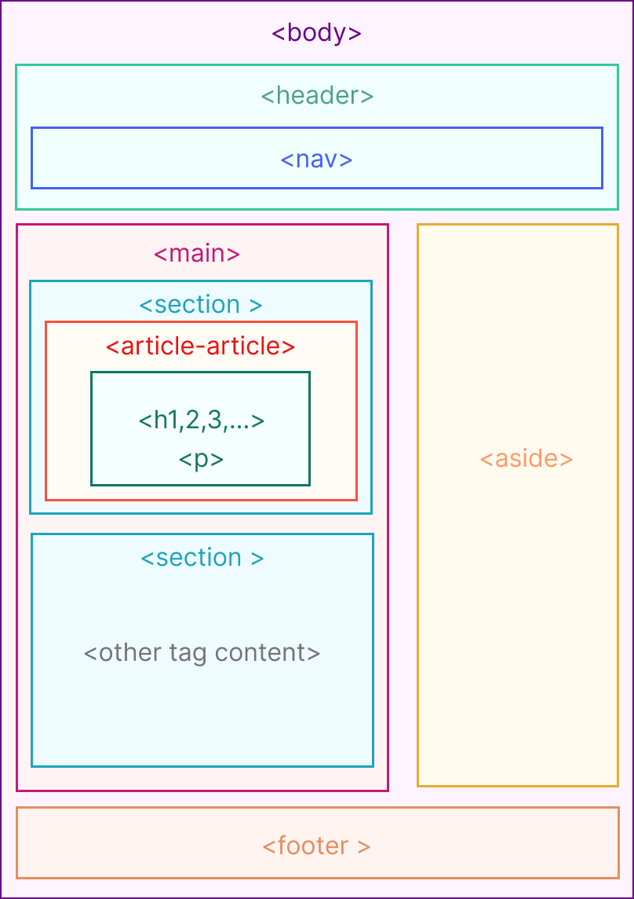

# Tugas HTML & CSS

Buatlah sebuah HTML Page yang berisi implementasi semantic HTML dan CSS. HTML Page yang dibuat harus memenuhi kriteria seperti pada gambar berikut:

### Kriteria:

1. Gunakan semantic HTML sesuai dengan struktur yang ada pada gambar.
   - Untuk `<section>` boleh lebih dari 1.
   - Untuk `<article>` minimal 3.
2. Gunakan CSS untuk mengatur tata letak (layout) dan tampilan (styling) dari HTML Page yang dibuat.

   Diperbolehkan menggunakan library tailwind CSS, tetapi tidak boleh menggunakan bootstrap, materilize, ataupun library yang berbasis komponen CSS lainnya.

3. HTML Page yang dibuat harus responsive, minimal memiliki 2 layout (desktop dan mobile).
